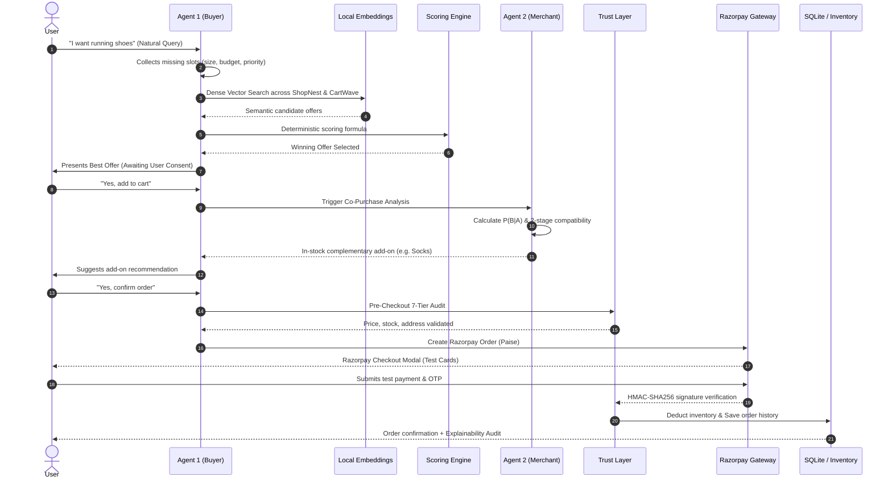

# 📖 Agentic Commerce Platform — Complete System Guide & Architecture

This document provides the complete, authoritative technical guide, architecture breakdown, mathematical formulas, and security protocols for the **Agentic Commerce Platform**, matching the interactive system documentation in `frontend/guide.html`.

---

## 📑 Table of Contents
1. [End-to-End System Workflow (MVP)](#1-end-to-end-system-workflow-mvp)
2. [Authentication & Database Architecture](#2-authentication--database-architecture)
3. [Agent 1 — AI Buyer Agent](#3-agent-1--ai-buyer-agent)
4. [Agent 2 — Sales Improvement Agent](#4-agent-2--sales-improvement-agent)
5. [Local Semantic Search & Vector Embeddings](#5-local-semantic-search--vector-embeddings)
6. [Trust Layer & The 7 Security Guardrails](#6-trust-layer--the-7-security-guardrails)
7. [Razorpay Test Mode & Transparency Audit](#7-razorpay-test-mode--transparency-audit)

---

## 1. End-to-End System Workflow (MVP)

### What is this Project?
This project is a **Multi-Agent E-Commerce Platform** connecting two merchant storefronts (**ShopNest** and **CartWave**) with an intelligent conversational shopping assistant (**Agent 1**) and an automated merchant sales improvement agent (**Agent 2**).

> **Why Now:**  
> NPCI’s UAP and the global protocol race (ACP, AP2, x402) make agent-to-agent commerce the open problem of the year, and Razorpay’s in-app pilots are already live.

> **The Bar:**  
> Every money action must be explainable, bounded, and gated. The platform provides full audit trails and handles failures gracefully.

Instead of manually browsing multiple websites and guessing which store has the best deal or right size, users simply talk to the AI in plain English. The platform compares prices, checks live stock, suggests compatible add-ons, and completes checkouts with test payments.

### Core Architectural Highlights
1. **Multi-Agent System (MAS Collaboration)**: Agent 1 (Buyer agent) and Agent 2 (Merchant sales optimizer) work together to balance customer savings and improve merchant sales with smart recommendations.
2. **Natural Language Search**: Finds items via vector similarity even when you don't type exact keywords.
3. **Deterministic Fairness**: Mathematical scoring guarantees the cheapest or highest-rated offer always wins.
4. **Trust Layer Security**: Never trusts AI blindly; guards against price tampering, stockouts, and unapproved charges.

### Complete 10-Step User Journey

---

## 2. Authentication & Database Architecture

### Password Security & What is a "Salt"?
Passwords are never stored in plain text. Instead, they are hashed using **PBKDF2-HMAC-SHA256** with **100,000 iterations** and a unique 16-byte random **Salt**.

> **What is a Salt?**  
> A Salt is a cryptographic random string added to the password before hashing. Even if two users choose the exact same password (e.g., `Password123`), their stored hashes will look completely different, protecting against dictionary attacks and precomputed Rainbow Tables.

### Primary Keys vs Foreign Keys
Across the entire SQLite database (`backend/data/app.db`), there are exactly:
- **4 Primary Keys (PK)**: `users.id`, `user_sessions.id`, `user_addresses.id`, `user_orders.id` (Unique ID for each row).
- **3 Foreign Keys (FK)**: All 3 Foreign Keys point back to `users.id` to identify which user owns that address, session, or order.

### The 4 SQLite Database Tables

| Table Name | Primary Key | Foreign Key | Stored Details |
| :--- | :--- | :--- | :--- |
| **`users`** | `id` (INTEGER) | *None* | User's name, email (unique lowercase), 100,000-iteration password hash, random 16-byte salt, creation timestamp. |
| **`user_sessions`** | `id` (INTEGER) | `user_id` → `users.id` | 32-byte secure bearer token, expiration timestamp (valid for 30 days). |
| **`user_addresses`** | `id` (INTEGER) | `user_id` → `users.id` | Recipient name, phone, address lines 1 & 2, city, state, postal PIN code, country. |
| **`user_orders`** | `id` (INTEGER) | `user_id` → `users.id` | Order ID, merchant name, total INR amount, payment status, items JSON list, and shipping address snapshot. |

---

## 3. Agent 1 — AI Buyer Agent

### Overview
- **Primary Goal**: Represents the **Buyer's interests**. Understands what product the user wants, gathers missing options (size, color, budget), searches across stores, and deterministically scores offers so the buyer gets the best deal.
- **LLM Model**: `qwen/qwen3-8b:free` (High-speed multi-turn dialogue, natural conversation, smart slot extraction).
- **7 Built-in Tools**: Semantic search, Scoring engine, Agent 2 handoff, Trust Layer, Data Access (DAL), Razorpay payments, and Audit logger.

### Finite State Machine (FSM)
A **Finite State Machine (FSM)** is a mathematical model of computation where the system can only exist in **exactly one state at any moment**.

> **Why FSM is Used in Agent 1:**  
> If an AI chatbot is purely open-ended without an FSM, it could forget required shoe sizes, add items to cart without permission, hallucinate that an order is paid, or skip vital stock checks.

#### The 6 Core States (Nodes) in Agent 1:
1. **`COLLECTING_REQUIREMENTS`**: Asks the user for missing info (product name, size, color, budget, priority). Once all slots are filled &rarr; transitions to State 2.
2. **`AWAITING_MAIN_CART_CONFIRMATION`**: Presents the winning offer. If User says **Yes** &rarr; transitions to State 3. If **No** &rarr; back to State 1.
3. **`AWAITING_COMPLEMENTARY_CART_CONFIRMATION`**: Presents cross-sell recommendation from Agent 2. Whether User says **Yes** or **No** &rarr; transitions to State 4.
4. **`AWAITING_ORDER_CONFIRMATION`**: Shows full cart summary with total INR. If User says **Yes** &rarr; creates payment order and goes to State 5.
5. **`AWAITING_PAYMENT`**: Waits for Razorpay checkout to finish. Once payment signature is verified &rarr; transitions to State 6.
6. **`READY_FOR_PURCHASE` (Terminal)**: Deducts live inventory, logs merchant order, saves into SQLite database, and clears cart.

### Mathematical Scoring Engine & Formulas
Offers are scored on a scale from `0.0` to `1.0` using three deterministic formulas:

$$\text{Price Score} = \frac{\text{Max Price} - \text{Product Price}}{\text{Max Price} - \text{Min Price}}$$

$$\text{Rating Score} = \frac{\text{Product Rating}}{5.0}$$

$$\text{Value Score} = (W_P \times \text{Price Score}) + (W_R \times \text{Rating Score})$$

#### Weight Matrix by Priority Mode:
| Priority Mode | Price Weight ($W_P$) | Rating Weight ($W_R$) | Optimization Goal |
| :--- | :--- | :--- | :--- |
| **`cheapest`** | **90% (0.90)** | **10% (0.10)** | Gives heavy advantage to lowest price. |
| **`highest_rated`** | **10% (0.10)** | **90% (0.90)** | Gives heavy advantage to top customer reviews. |
| **`best_balance`** | **50% (0.50)** | **50% (0.50)** | Equal balance between price and quality rating. |

#### Real Example: Smartwatch Search (`cheapest` priority)
Suppose ShopNest offers a Smartwatch for **₹3,500 (Rating 4.8★)** and CartWave offers it for **₹3,000 (Rating 4.2★)**:

- **ShopNest Calculation**:
  - $\text{Price Score} = \frac{3500 - 3500}{500} = \mathbf{0.0}$
  - $\text{Rating Score} = \frac{4.8}{5.0} = \mathbf{0.96}$
  - $\text{Value Score} = (0.90 \times 0.0) + (0.10 \times 0.96) = \mathbf{0.096}$

- **CartWave Calculation**:
  - $\text{Price Score} = \frac{3500 - 3000}{500} = \mathbf{1.0}$
  - $\text{Rating Score} = \frac{4.2}{5.0} = \mathbf{0.84}$
  - $\text{Value Score} = (0.90 \times 1.0) + (0.10 \times 0.84) = \mathbf{0.984}$

🏆 **Winner**: **CartWave** ($0.984 > 0.096$).

---

## 4. Agent 2 — Sales Improvement Agent

### Overview
- **Primary Goal**: Maximizes Average Order Value (AOV) by suggesting a single, relevant, in-stock item frequently bought together with the main product.
- **LLM Model**: `cohere/north-mini-code:free` (Lightweight, sub-500ms speed, writes natural 1–2 sentence pitch without hallucinating discounts).
- **5 Built-in Tools**: Historical orders reader, Compatibility validator, Price disproportionality filter, Live inventory checker, and LLM copywriter.

### Co-Purchase Probability Formula: $P(B | A)$
Agent 2 scans all historical orders from the merchant and calculates:

$$P(B \mid A) = \frac{\text{Orders containing BOTH Product A and Product B}}{\text{Total orders containing Product A}}$$

> **Example**: If 50 customers bought Running Shoes (Product A), and 35 of those orders also included Athletic Socks (Product B), the co-purchase probability is $\frac{35}{50} = \mathbf{70\%}$.

### 2-Stage Category & Semantic Compatibility Validator
1. **Stage 1: Category Cluster Matching (Hard Filter)**:  
   Ensures products belong to matching domains (e.g. Footwear goes with Footwear Accessories or Fitness Gear; never with Kitchenware).
2. **Stage 2: Dense Semantic Similarity (AI Filter)**:  
   Uses vector embeddings to ensure descriptions match functionally (e.g., shoe polish matches leather formal shoes, but not mesh running sneakers).

---

## 5. Local Semantic Search & Vector Embeddings

### Embedding Model: `all-MiniLM-L6-v2`
- Runs 100% locally on CPU using HuggingFace and PyTorch.
- Converts each product's title, category, description, and specs into a **384-dimensional vector**.
- **Vector Dimension**: 384
- **Total Stored Vectors**: 100 (50 for ShopNest + 50 for CartWave)
- **Memory Footprint**: < 150 KB RAM

### Chunking Decision
> **Intentionally No Text Chunking:**  
> In document search systems (like long PDF search), documents are sliced into 500-word chunks. But in our e-commerce catalog, each product is already concise (~40–80 words), so **1 complete product directly maps to 1 single vector**. Chunking would split the product title away from its available sizes and colors, breaking semantic search accuracy.

### Why NO External Vector Database?
Our platform contains **50 products per merchant (100 product vectors in total)**. For this catalog size (just 100 vectors), connecting to an external Vector Database (like Pinecone, Milvus, or Chroma) introduces unnecessary complexity, network latency, and cloud costs.
1. **Ultra-Fast (< 0.05 ms vs 100 ms)**: NumPy dot product on 100 vectors directly in CPU memory takes microseconds.
2. **Zero Infrastructure Cost & Complexity**: No subscriptions, no Docker containers, and no complex cluster maintenance.
3. **100% In-Memory Sync**: Vectors stay perfectly synchronized with the local merchant catalogs.

---

## 6. Trust Layer & The 7 Security Guardrails

### Why Do We Need a Trust Layer?
Large Language Models are probabilistic text generators. If you let an AI write directly to your database, it could invent a 90% discount, sell products with zero stock, or charge cards without authorization. The Trust Layer intercepts every action with **7 non-negotiable rules**:

1. **Guardrail 1: Price Consistency & Anti-Tamper**:  
   Compares the offer price against the merchant's live catalog. If an AI hallucinates a discount, it is blocked with `PRICE_MISMATCH`.
2. **Guardrail 2: Real-Time Inventory Check**:  
   Verifies that available stock is $\ge$ requested quantity ($\text{Stock} \ge \text{Quantity}$). Prevents overselling with `PRODUCT_OUT_OF_STOCK`.
3. **Guardrail 3: Explicit User Consent**:  
   Requires the user to explicitly confirm before any add-on recommendation enters the cart. Blocks automatic carting with `USER_DECLINED`.
4. **Guardrail 4: Merchant & Product Identity**:  
   Confirms the merchant is strictly `shopnest` or `cartwave` and that the product ID exists. Blocks fake names with `MERCHANT_NOT_FOUND`.
5. **Guardrail 5: Pre-Checkout Cart Consistency**:  
   Audits every item in the cart simultaneously right before generating the payment invoice to ensure stock hasn't depleted while chatting.
6. **Guardrail 6: Delivery Address Completeness**:  
   Ensures recipient name, phone, street, city, state, and pincode exist in database before allowing checkout initialization.
7. **Guardrail 7: Cryptographic Payment Signature & Idempotency**:  
   Computes `HMAC-SHA256` to verify that payment confirmations genuinely originate from Razorpay servers and prevents duplicate charges on repeated clicks.

---

## 7. Razorpay Test Mode & Transparency Audit

### Razorpay Sandbox in 3 Steps
Test mode is a simulated payment gateway where you can test the complete real-world checkout process with fake cards (`4111 1111...`) and test OTPs (`123456`) without spending actual money.

1. **Create Order**: Converts INR to paise (₹100 = 10,000 paise) and creates a secure Razorpay Order ID.
2. **Checkout Popup**: User enters mock card details in the Razorpay modal. Razorpay returns a digital signature.
3. **Verify & Deliver**: Backend validates HMAC signature, reduces stock in inventory, and confirms the purchase.

### Explainability Audit Engine
The platform creates a comprehensive audit report for every single session, answering: *"Why did the AI make this decision?"*
- **User Requirements**: Exact extracted slots (budget, size, color, priority).
- **Score Calculations**: Exact Price Score, Rating Score, and Value Score for all offers.
- **Agent 2 Co-Purchase Stats**: Shows historical order counts and co-purchase percentages.
- **Trust Layer Verification Logs**: Timestamped proof of stock and catalog price checks.
- **PDF Export**: Downloadable client-side audit certificate generated via jsPDF.

---

*Agentic Commerce Platform © 2026 • Multi-Agent Architecture & System Guide*
